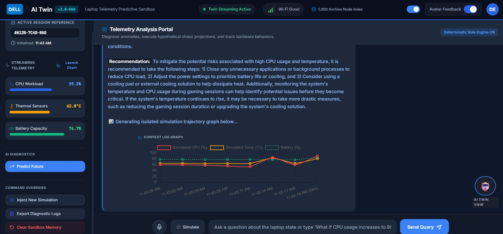

# 💻 Dell AI Digital Twin — Laptop Telemetry Intelligence

A virtual, AI-powered **Digital Twin** for consumer laptops that monitors live hardware telemetry signals, reasons over system stress, conducts "What-If" scenario simulations, and provides explainable diagnostics.

Built as part of the **Dell Hackathon**, this project demonstrates how a conversational AI system backed by a **Deterministic Rule Engine** and **BM25 Retrieval-Augmented Generation (RAG)** can replace the need for physical device access during remote troubleshooting.

---

## 📸 Interface & Feature Highlights

### 1. Dynamic Telemetry Engine & Interactive Graph

Real-time tracking of thermal boundaries, CPU workload gradients, and battery discharge rates inside an interactive modal overlay.


---

### 2. AI Predictive Failure Analysis & Explainable AI (XAI)

Calculates metric slopes over rolling windows to forecast device health while displaying full BM25 dataset retrieval traces inside the Transparency Log.


---

### 3. "What-If" Sandbox Simulation & Dark Mode Interface

Simulates hypothetical stress scenarios (e.g., CPU spikes, high workloads) with inline trajectory graphs and real-time lip-sync avatar feedback in an enterprise dark theme.



---

## 🚀 Key Features

- **Real-Time Telemetry Streaming:** Streams and visualizes CPU workload, thermal core readings, fan RPMs, battery depletion, and disk health metrics.
- **Deterministic Rule Engine (0% Hallucination):** Pre-evaluates metrics mathematically in Java before passing parameters to the LLM to prevent false hardware diagnostics.
- **Semantic Historical Retrieval (RAG):** Integrates an in-memory **BM25 Retriever** indexed over 1,000 synthetic telemetry archive records to match current behavior against historical patterns.
- **"What-If" Sandbox Simulations:** Simulates complex hardware stress conditions (e.g., _"What if CPU load increases to 90%?"_) to project thermal climbs, fan acoustic targets, and power draw.
- **Explainable AI (XAI) Transparency Log:** Collapsible UI log drawer exposing the exact hardware values and BM25 historical context used by the model for every diagnosis.
- **AI Predictive Failure Analysis:** Analyzes rolling sliding windows (10 intervals) to compute metric slopes and forecast health risks 30–40 minutes ahead.
- **Interactive Visualization Dashboard:** Built-in modal graph powered by Chart.js displaying live multi-dimensional performance trendlines.
- **Multimodal Voice & Avatar Integration:** Features Web Speech API recognition for voice commands and Web Speech Synthesis paired with SVG mouth lip-sync animations.

---

## 🛠 Tech Stack & Architecture

- **Backend Framework:** Java 17 / 24, Spring Boot 3.2.0 (REST API)
- **LLM Engine:** Groq API (`llama-3.3-70b-versatile`)
- **Retrieval / Vector Engine:** Native BM25 Document Retriever / Supabase Storage
- **JSON Processing:** Jackson Databind Engine
- **Frontend UI:** HTML5, Modern Vanilla JavaScript (ES6+), Tailwind CSS (CDN), Lucide Icons, Chart.js

---

## 📁 Project Structure

```text
dell-hackathon/
├── src/
│   └── main/
│       ├── java/com/dell/twin/
│       │   ├── BM25Retriever.java         # RAG Search Index Engine over CSV logs
│       │   ├── ChatController.java        # Spring REST API Controller (/api/chat, /api/predict)
│       │   ├── Constants.java             # System constants and schema configuration
│       │   ├── CsvMapperAndUploader.java  # CSV reader, noise generator & database uploader
│       │   ├── DataLoader.java            # CSV Telemetry DataLoader component
│       │   ├── GroqClient.java            # HTTP Client for Groq API integration
│       │   ├── HealthService.java         # Rule-based health calculation algorithms
│       │   ├── TelemetryRow.java          # Data Transfer Object for Telemetry Schema
│       │   └── TwinBackendApplication.java# Spring Boot Main Entry Point
│       └── resources/
│           ├── static/
│           │   └── index.html             # Command Center Frontend Dashboard
│           └── application.properties
├── .env                                   # API Keys & Secrets Configuration
├── dell_like_laptop_telemetry_1000_rows-1.csv # Primary Synthetic Telemetry Dataset
└── pom.xml                                # Maven Dependencies & Build File
```

# ⚙️ Setup and Installation

## Prerequisites

- Java Development Kit (JDK 17 or higher)
- Apache Maven 3.8+
- Groq API Key (Obtain from [console.groq.com](https://console.groq.com))

## 1. Clone the Repository

```bash
git clone https://github.com/your-username/dell-twin-ai.git
cd dell-hackathon
```

## 2. Configure Environment Variables

Create a `.env` file in the root directory of the project:

```
GROQ_API_KEY=gsk_your_actual_groq_api_key_here
SUPABASE_URL=https://your-supabase-project.supabase.co
SUPABASE_KEY=your_supabase_anon_key
```

## 3. Build the Project

Build the Maven dependencies and compile the Java source files:

```bash
mvn clean install
```

## 4. Run the Application

Launch the Spring Boot web application:

```bash
mvn spring-boot:run
```

Once started, open your web browser and navigate to:  
👉 **http://localhost:8080**

---

# 🎯 Example Usage & Queries

### 1. General Diagnostics

- "Why is my laptop running so hot?"
- "Why is my battery draining fast?"
- "Is my NVMe disk health normal?"

### 2. "What-If" Simulations

- "What if CPU usage increases to 90%?"
- "Simulate high workload rendering while on battery power."

### 3. Visual Charts & Trends

- "Show me the performance graph"
- Or click **"Launch Chart"** inside the Quick Insights sidebar panel.

### 4. Failure Prediction

Click **"Predict Future"** in the sidebar to generate slope-based predictive failure analysis.
